<!-- Improved compatibility of back to top link: See: https://github.com/othneildrew/Best-README-Template/pull/73 -->
<a name="readme-top"></a>
<!--
*** Thanks for checking out the Best-README-Template. If you have a suggestion
*** that would make this better, please fork the repo and create a pull request
*** or simply open an issue with the tag "enhancement".
*** Don't forget to give the project a star!
*** Thanks again! Now go create something AMAZING! :D
-->


<!-- PROJECT SHIELDS -->
<!--
*** I'm using markdown "reference style" links for readability.
*** Reference links are enclosed in brackets [ ] instead of parentheses ( ).
*** See the bottom of this document for the declaration of the reference variables
*** for contributors-url, forks-url, etc. This is an optional, concise syntax you may use.
*** https://www.markdownguide.org/basic-syntax/#reference-style-links
-->
[![Contributors][contributors-shield]][contributors-url]
[![Forks][forks-shield]][forks-url]
[![Stargazers][stars-shield]][stars-url]
[![Issues][issues-shield]][issues-url]
[![MIT License][license-shield]][license-url]


<!-- PROJECT LOGO -->
<br />
<div align="center">
<h3 align="center">TSI Ticketing System</h3>

  <p align="center">
    A serverless AWS ticketing system for Microsoft Teams 
    <br />
    <a href="https://github.com/Jordan527/TSI-Ticketing-System"><strong>Explore the docs »</strong></a>
    <br />
    <br />
    <a href="https://github.com/Jordan527/TSI-Ticketing-System/issues">Report Bug</a>
    ·
    <a href="https://github.com/Jordan527/TSI-Ticketing-System/issues">Request Feature</a>
  </p>
</div>


<!-- TABLE OF CONTENTS -->
<details>
  <summary>Table of Contents</summary>
  <ol>
    <li>
      <a href="#about-the-project">About The Project</a>
      <ul>
        <li><a href="#key-features">Key Features</a></li>
        <li><a href="#built-with">Built With</a></li>
      </ul>
    </li>
    <li>
      <a href="#setup">Setup</a>
      <ul>
        <li><a href="#prerequisites">Prerequisites</a></li>
        <li><a href="#installation">Installation</a></li>
        <li><a href="#create-an-ngrok-account">Create an Ngrok account</a></li>
        <li><a href="#create-a-new-team-in-ms-teams">Create a new team in MS Teams</a></li>
        <li><a href="#create-an-outgoing-webhook-in-ms-teams">Create an outgoing webhook in MS Teams</a></li>
      </ul>
    </li>
    <li>
      <a href="#aws-configuration">AWS Configuration</a>
      <ul>
        <li><a href="#iam-user">IAM User</a></li>
        <li><a href="#aws-secret-manager">AWS Secret Manager</a></li>
      </ul>
    </li>
    <li><a href="#trello-integration-configuration">Trello Integration Configuration</a></li>
    <li><a href="#slack-app-configuration">Slack App Configuration</a></li>
    <li>
      <a href="#deployment">Deployment</a>
      <ul>
        <li><a href="#local">Local</a></li>
        <li><a href="#docker-compose">Docker Compose</a></li>
        <li><a href="#kubernetes">Kubernetes</a></li>
      </ul>
    </li>
    <li><a href="#usage">Usage</a></li>
    <li><a href="#roadmap">Roadmap</a></li>
    <li><a href="#contributing">Contributing</a></li>
    <li><a href="#license">License</a></li>
    <li><a href="#acknowledgments">Acknowledgments</a></li>
  </ol>
</details>


<!-- ABOUT THE PROJECT -->
## About The Project

The TSI Ticketing System is a comprehensive bug ticketing system designed to streamline the process of reporting, tracking, and resolving software issues. Leveraging Python Flask for the backend, Microsoft Teams for collaboration, Power Automate for workflow automation, and AWS for scalable infrastructure, offering a seamless experience for development teams to manage bugs efficiently.
<p align="right">(<a href="#readme-top">back to top</a>)</p>

### Key Features
* Bug Reporting: Users can easily report bugs by filling out a structured form within the application, providing essential details such as bug description, severity, screenshots, and steps to reproduce.
* Ticket Tracking: Facilitates real-time tracking of bug tickets, allowing developers and managers to monitor the status of reported issues, assign tasks, and set priorities.
* Integration with Microsoft Teams: Seamless integration with Microsoft Teams enables automatic notifications and updates on bug ticket status changes, ensuring effective communication among team members.
* AWS Cloud Infrastructure: Hosted on AWS, offering scalability, reliability, and security, ensuring high availability and performance for handling bug tracking operations.

<p align="right">(<a href="#readme-top">back to top</a>)</p>


### Built With

* [![Flask][Flask.com]][Flask-url]
* [![Ngrok][Ngrok.com]][Ngrok-url]
* [![Docker][Docker.com]][Docker-url]
* [![Kubernetes][Kubernetes.com]][Kubernetes-url]
* [![AWS][AWS.com]][AWS-url]
* [![Teams][Teams.com]][Teams-url]

<p align="right">(<a href="#readme-top">back to top</a>)</p>


<!-- SETUP -->
## Setup

To get run your own version of the TSI Ticketing System, follow the instructions below.

### Prerequisites
* AWS Account
* Ngrok Account
* Python v3.12.7 (optional depending on deployment strategy)
* Docker & Docker Compose (optional depending on deployment strategy)
* Kubectl (optional depending on deployment strategy)


### Installation
1. `git clone` the repository.
```sh
git clone https://github.com/Jordan527/TSI-Ticketing-System.git
```

<p align="right">(<a href="#readme-top">back to top</a>)</p>

### Create an Ngrok account
1. Go to [https://ngrok.com/](https://ngrok.com/) and sign up
2. Follow the installation steps.
3. In the `Deploy your app online` section, select the second tab `Static Domain`.
4. Click the link to claim your free static domain, and save the command presented, it should look like this: `ngrok http --domain=your-domain-name.ngrok-free.app 80`

<p align="right">(<a href="#readme-top">back to top</a>)</p>

### Create a new team in MS Teams
1. Click the `+` button on the Teams tab of MS Teams and select `Create team`.

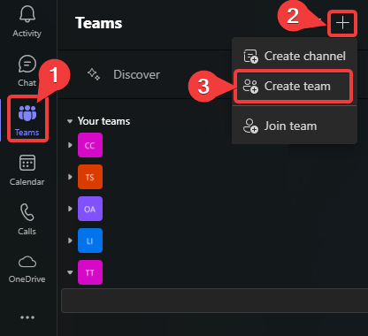

2. Fill the `Team name` and `Name the first channel` field before clicking the `Create` button

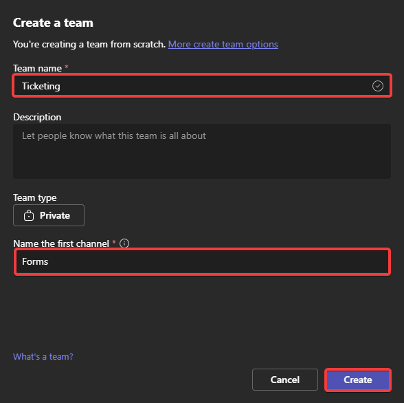


<p align="right">(<a href="#readme-top">back to top</a>)</p>

### Create an outgoing webhook in MS Teams
1. Click the `...` on the team name and select `Manage team`

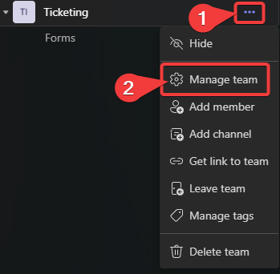

2. Navigate to the `Apps` and click the `Create an outgoing webhook` button above the list of apps

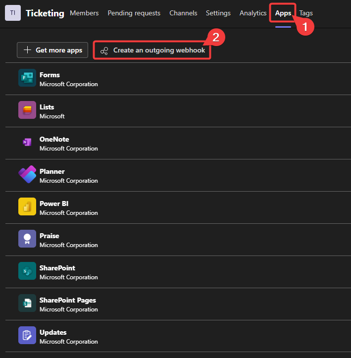

3. Fill out the form
    - Add a name to the webhook (this will be used for calling the bot)
    - Add your Ngrok URL as the calback url, which should match the following format: `your-domain-name.ngrok-free.app`
    - Add a description

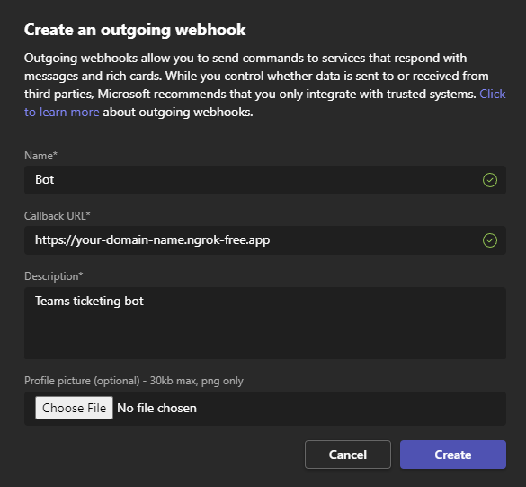

7. Click the `Create` button

<p align="right">(<a href="#readme-top">back to top</a>)</p>

## AWS Configuration
### IAM User
1. Open the AWS Management Console and navigate to `IAM`.
2. Select `Users` on the left panel then click `Create user`.
3. Enter a name like `ticket.bot` and click `Next`.

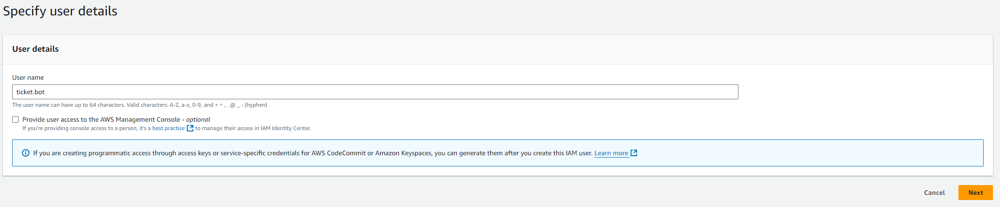

4. Under permissions keep the `Add user to group` option selected.
5. Under `User groups` create a new user group.
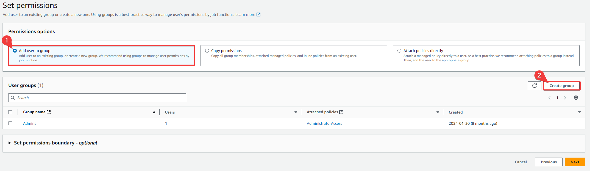
   1. Add a name for the user group like `ticket-admin`.
   2. Search and select the permission policy called `SecretsManagerReadWrite`.
   3. Search and select the permission policy called `AmazonSQSFullAccess`.
   4. Search and select the permission policy called `IAMFullAccess`.
   5. Search and select the permission policy called `AmazonS3FullAccess`.
   6. Search and select the permission policy called `AWSLambda_FullAccess`.
   7. Select `Create user group` to create the group.
6. Select your newly created user group and click `Next`.

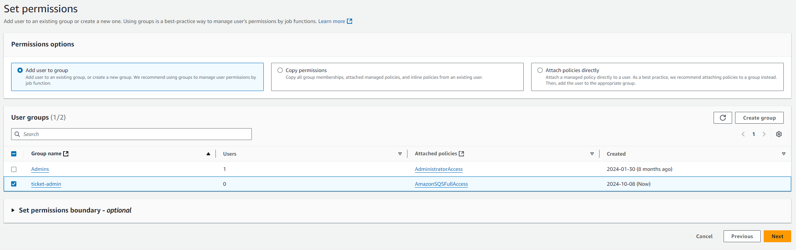

7. Click `Create user` to create the IAM user.
8. In the user, under the `Security credentials` tab and `Access keys` section, click `Create access key`.
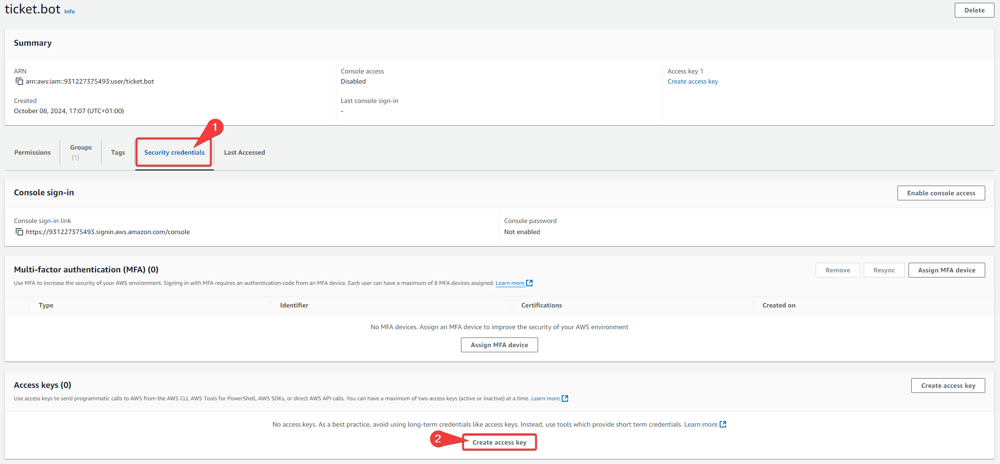
   1. Select `Command Line Interface (CLI)`, tick the confirmation box and click `Next`.
   2. Click `Create access key`.
   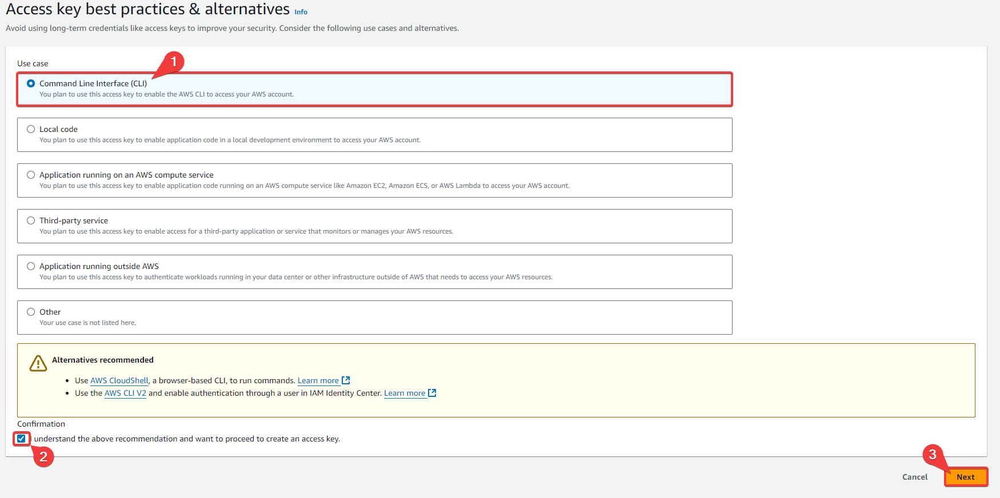
   3. Save both the public and private access keys somewhere safe, not in plain text, and click `Done`.
   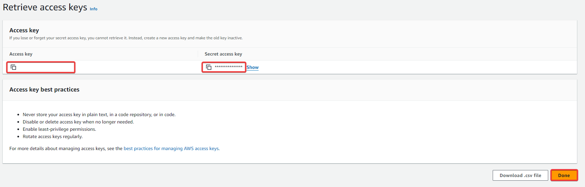

<p align="right">(<a href="#readme-top">back to top</a>)</p>

### AWS Secret Manager
1. In the same AWS region as you would like to use for the rest of servcices, create an AWS secret
2. Select `Other type of secret`

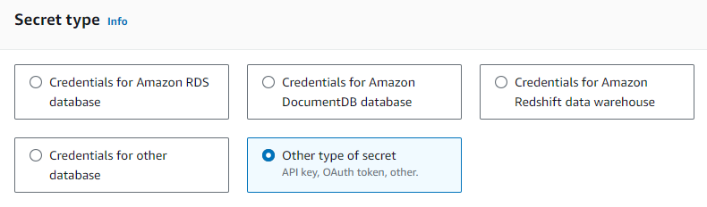

3. Enter the following as the `Plaintext` value for the `Key/value` fiekd, changing the values for your own
```
{
  "PREFIX":"<prefix_name>",
  "TRELLO_API_KEY":"<trello_api_key>",
  "TRELLO_API_TOKEN":"<trello_api_token>",
  "TRELLO_BOARD_ID":"<trello_board_id>",
  "TRELLO_LIST_NAME":"<trello_list_name>",
  "SLACK_URL":"<slack_app_name>"
}
``` 

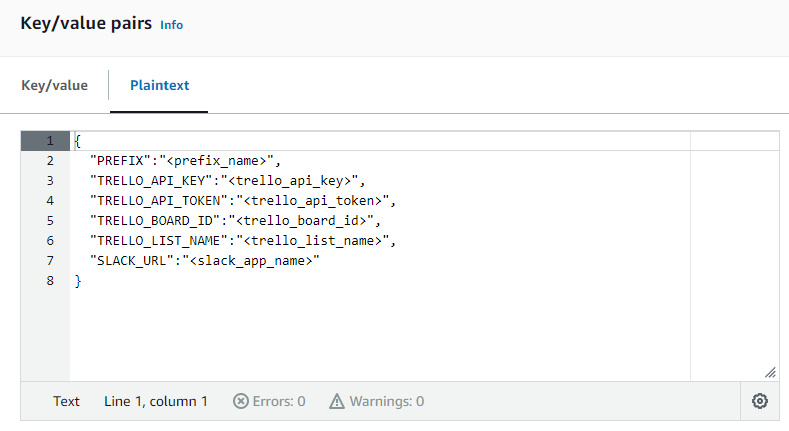

4. Switch the type back to `Key/value` to verify the `Plaintext` syntax

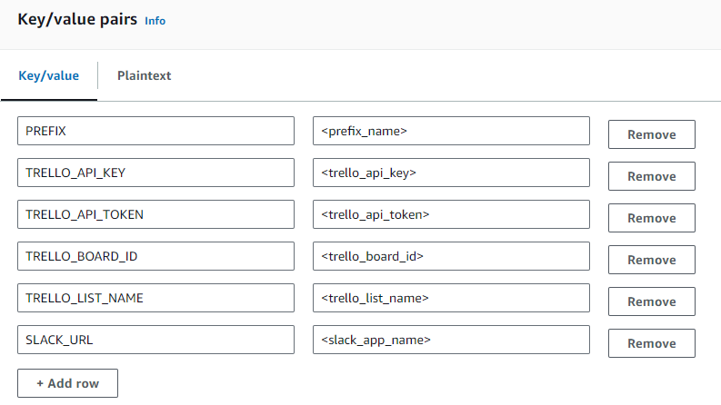

4. Click the `Next` button
5. Enter a secret name and click `Next`
6. Click `Next` again then click `Store`

<p align="right">(<a href="#readme-top">back to top</a>)</p>

## Trello Integration Configuration
1. navigate to https://trello.com/power-ups/admin/ and login with the account you would like the service to use. The account **must** have access to the trello board
2. Navigate to the `Power-Ups` tab and click the `New` button

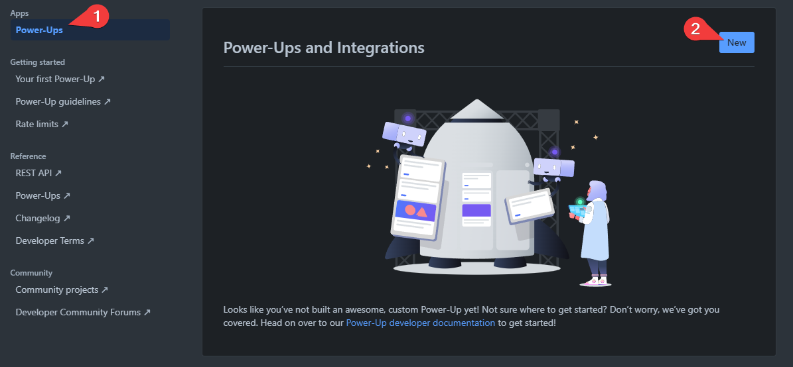

3. Fill out all fields in the form except from the `Iframe connector URL` and click `Create`

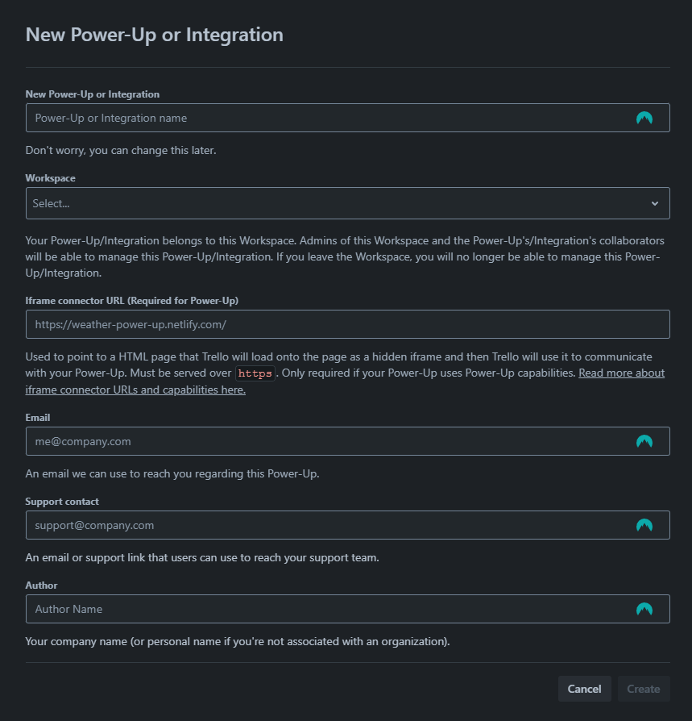

4. Navigate to the `Api Key` tab and click the `Generate a new API key` button

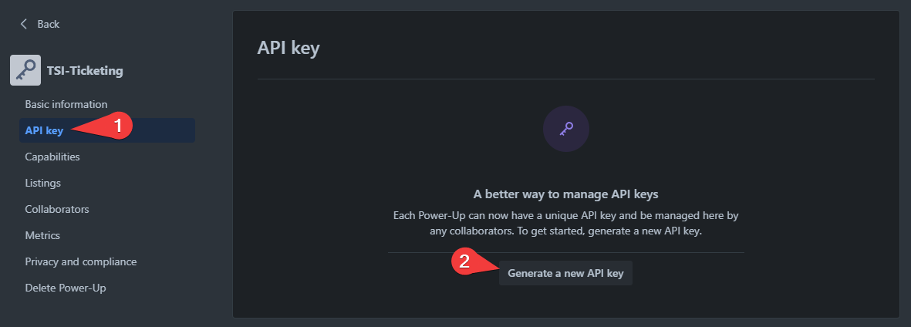

5. Save both the key and secret somewhere safe, not in plain text.

<p align="right">(<a href="#readme-top">back to top</a>)</p>

## Slack App Configuration
1. Navigate to https://api.slack.com/apps 
2. Click the `Create New App` button

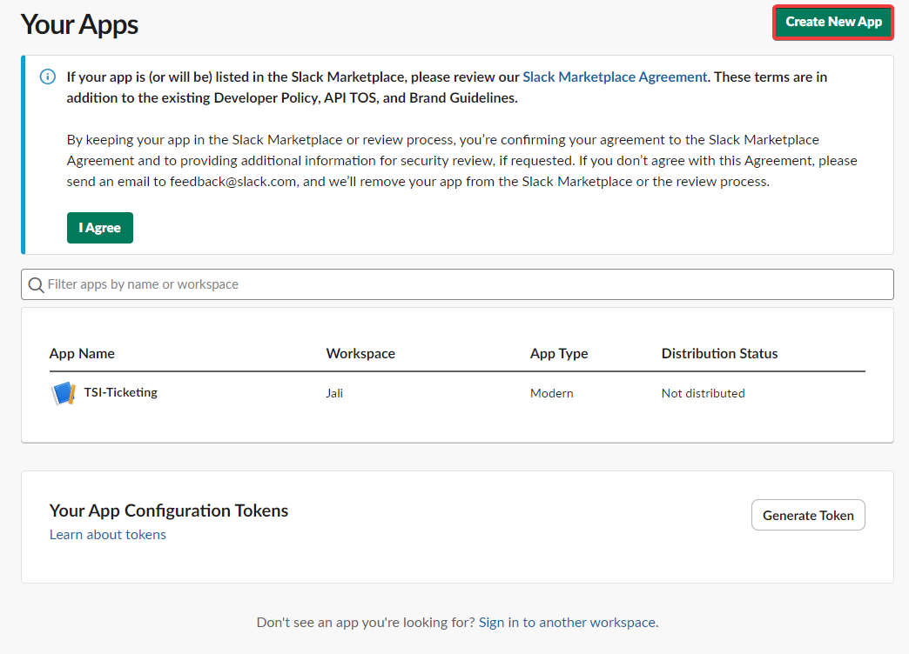

3. Select the `From scratch` option

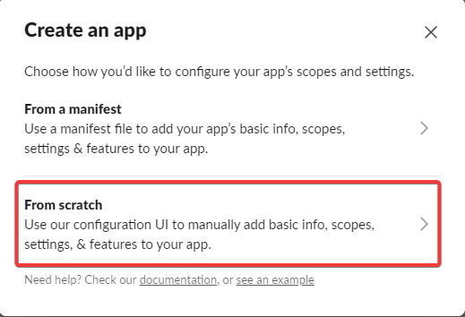

4. Enter a name and workspace before clicking the `Create App` button

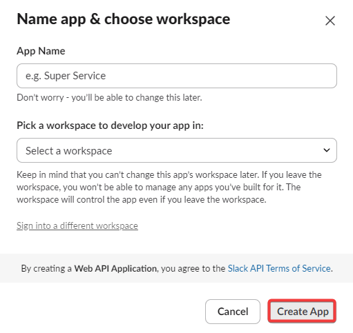

5. In your app, navigate to the `Incoming Webhooks` tab under `Features` and active incoming webhooks

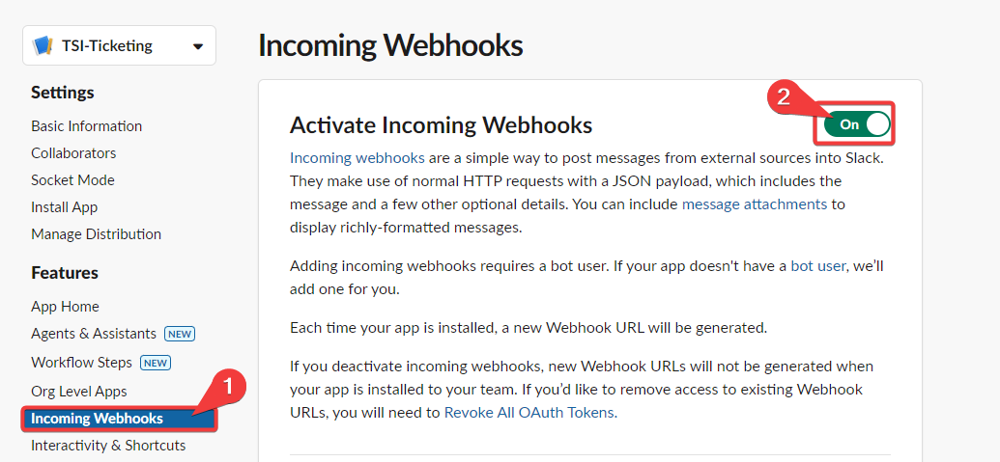

6. Click the `Add New Webhook to Workspace` button and select a channel

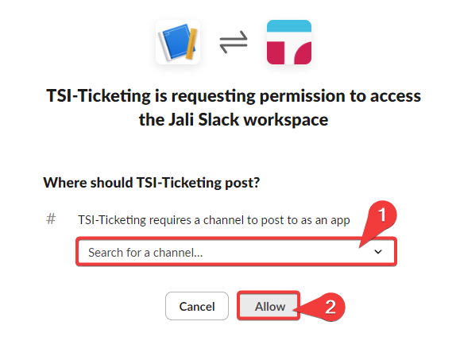

7. Make a note of the webhook URL

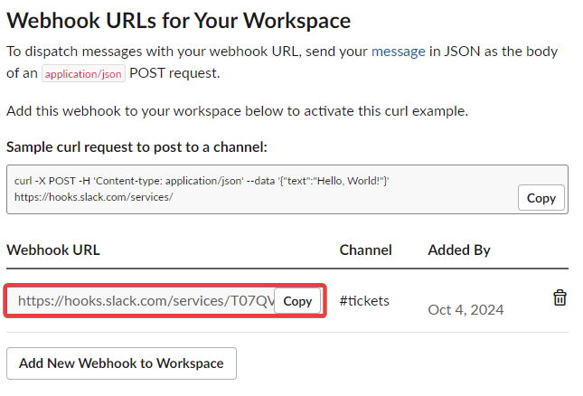

<p align="right">(<a href="#readme-top">back to top</a>)</p>

## Deployment
### Local
- Create environment variables for the following:
  - `AWS_REGION`
  - `AWS_ACCESS_KEY_ID`
  - `AWS_SECRET_ACCESS_KEY`
  - `NGROK_DOMAIN`
  - `NGROK_TOKEN`
  
- Run `pip install -r requirements.txt`
- Run the `start.sh` file

<p align="right">(<a href="#readme-top">back to top</a>)</p>

### Docker Compose
1. Customise the following environment variables in `docker-compose.yaml`
    - `AWS_REGION`
    - `AWS_ACCESS_KEY_ID`
    - `AWS_SECRET_ACCESS_KEY`
    - `NGROK_DOMAIN`
    - `NGROK_TOKEN`
2. Run `docker compose up -d`

#### Note
If changes are made to the `AWS_REGION` value and the `PREFIX` value has not been changed, the system will attempt to create a new bucket in the new region, but will revert back to the original region for the bucket if the name is unavailable.

<p align="right">(<a href="#readme-top">back to top</a>)</p>

### Kubernetes
1. Navigate to https://dashboard.ngrok.com/api-keys and generate an API key
2. Customise the following variabels in `k8s_start.sh`
    - `aws_region`
    - `aws_access_key_id`
    - `aws_secret_access_key`
    - `ngrok_domain`
    - `ngrok_token`
    - `ngrok_api_key`
3. Configure kubectl to connect to your cluster
4. Run the `k8s_start.sh` file

<p align="right">(<a href="#readme-top">back to top</a>)</p>

## Usage
-  Fill out the a ticket in the MS Teams Channel using the following format, which is case insensitive:

```
@<webhook title>
Title: <title>
Priority: <priority (low, medium or high)>
Description: <description>
```

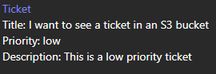

- Open your S3 bucket to find low priority logs

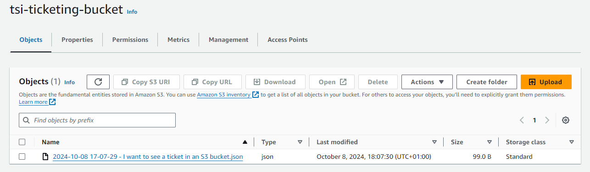

- Open your trello board for medium priority tickets

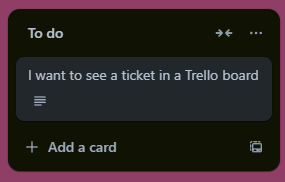

- Open your slack channel for high priority tickets

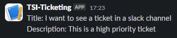

<!-- ROADMAP -->
## Roadmap

- [x] Get ticket data from the user
- [x] Send the ticket to one of three SQS queues depending on it's priority
    - [x] Low
    - [x] Medium
    - [x] High
- [x] Add Lambda functions to forward tickets to the relevant channels from the SQS queues
    - [x] Low priority to a s3 bucket
    - [x] Medium priority to a trello board
    - [x] High priority to a slack channel
- [x] Create a `Dockerfile` and `docker-compose.yaml` for easy deployment of the system
- [x] Monitor changes to the environment variables so that infrastructure can be managed between sessions
- [x] Change the S3 bucket ticket names to be more easily readable
- [x] Alter the `start.sh` file so that the flask app failing won't cause an infinite loop
- [x] Replace the use of environment variables to make secrets more secure
- [ ] Host the system in a cloud service, rather than running locally
- [ ] Create a lambda for the DLQ to notify an admin when a ticket is received

<!-- See the [open issues](https://github.com/Jordan527/TSI-Ticketing-System/issues) for a full list of proposed features (and known issues). -->

<p align="right">(<a href="#readme-top">back to top</a>)</p>

<!-- CONTRIBUTING -->
## Contributing

Contributions are what make the open source community such an amazing place to learn, inspire, and create. Any contributions you make are **greatly appreciated**.

If you have a suggestion that would make this better, please fork the repo and create a pull request. You can also simply open an issue with the tag "enhancement".
Don't forget to give the project a star! Thanks again!

1. Fork the Project
2. Create your Feature Branch (`git checkout -b feature/AmazingFeature`)
3. Commit your Changes (`git commit -m 'Add some AmazingFeature'`)
4. Push to the Branch (`git push origin feature/AmazingFeature`)
5. Open a Pull Request

<p align="right">(<a href="#readme-top">back to top</a>)</p>


<!-- LICENSE -->
## License

Distributed under the MIT License. See `LICENSE.md` for more information.

<p align="right">(<a href="#readme-top">back to top</a>)</p>


<!-- ACKNOWLEDGMENTS -->
## Acknowledgments

* [othneildrew README template](https://github.com/othneildrew/Best-README-Template/tree/master)

<p align="right">(<a href="#readme-top">back to top</a>)</p>


<!-- MARKDOWN LINKS & IMAGES -->
<!-- https://www.markdownguide.org/basic-syntax/#reference-style-links -->
[contributors-shield]: https://img.shields.io/github/contributors/Jordan527/TSI-Ticketing-System.svg?style=for-the-badge
[contributors-url]: https://github.com/Jordan527/TSI-Ticketing-System/graphs/contributors
[forks-shield]: https://img.shields.io/github/forks/Jordan527/TSI-Ticketing-System.svg?style=for-the-badge
[forks-url]: https://github.com/Jordan527/TSI-Ticketing-System/network/members
[stars-shield]: https://img.shields.io/github/stars/Jordan527/TSI-Ticketing-System.svg?style=for-the-badge
[stars-url]: https://github.com/Jordan527/TSI-Ticketing-System/stargazers
[issues-shield]: https://img.shields.io/github/issues/Jordan527/TSI-Ticketing-System.svg?style=for-the-badge
[issues-url]: https://github.com/Jordan527/TSI-Ticketing-System/issues
[license-shield]: https://img.shields.io/github/license/Jordan527/TSI-Ticketing-System.svg?style=for-the-badge
[license-url]: https://github.com/Jordan527/TSI-Ticketing-System/blob/master/LICENSE.md


[Flask.com]: https://img.shields.io/badge/flask-%23000.svg?style=for-the-badge&logo=flask&logoColor=white
[Flask-url]: https://flask.palletsprojects.com/en/3.0.x/

[Ngrok.com]: https://img.shields.io/badge/ngrok%20-%20%2302238f?style=for-the-badge
[Ngrok-url]: https://ngrok.com/

[Docker.com]: https://img.shields.io/badge/Docker%20-%20%231d63ed?style=for-the-badge&logo=docker&logoColor=white
[Docker-url]: https://docker.com

[Kubernetes.com]: https://img.shields.io/badge/kubernetes%20-%20%23326ce5?style=for-the-badge&logo=kubernetes&logoColor=white
[Kubernetes-url]: https://kubernetes.io/

[AWS.com]: https://img.shields.io/badge/AWS-%23FF9900.svg?style=for-the-badge&logo=amazon-aws&logoColor=white
[AWS-url]: https://aws.amazon.com

[Teams.com]: https://img.shields.io/badge/MS%20Teams-white?style=for-the-badge&logo=microsoft%20teams
[Teams-url]: https://www.microsoft.com/en-gb/microsoft-teams/group-chat-software
