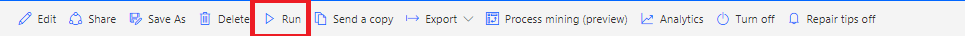
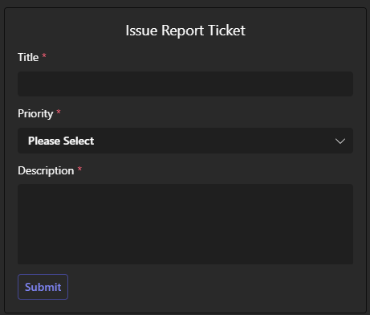
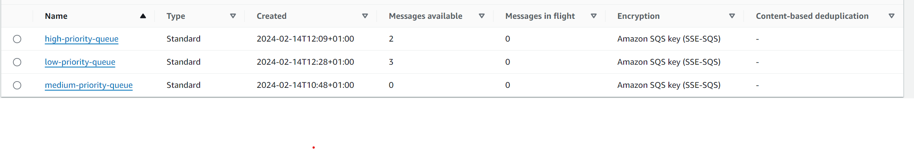
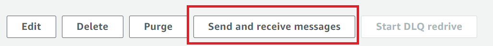
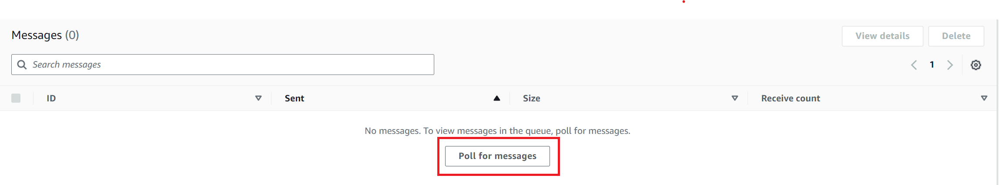
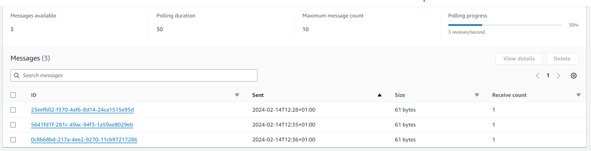

<!-- Improved compatibility of back to top link: See: https://github.com/othneildrew/Best-README-Template/pull/73 -->
<a name="readme-top"></a>
<!--
*** Thanks for checking out the Best-README-Template. If you have a suggestion
*** that would make this better, please fork the repo and create a pull request
*** or simply open an issue with the tag "enhancement".
*** Don't forget to give the project a star!
*** Thanks again! Now go create something AMAZING! :D
-->


<!-- PROJECT SHIELDS -->
<!--
*** I'm using markdown "reference style" links for readability.
*** Reference links are enclosed in brackets [ ] instead of parentheses ( ).
*** See the bottom of this document for the declaration of the reference variables
*** for contributors-url, forks-url, etc. This is an optional, concise syntax you may use.
*** https://www.markdownguide.org/basic-syntax/#reference-style-links
-->
[![Contributors][contributors-shield]][contributors-url]
[![Forks][forks-shield]][forks-url]
[![Stargazers][stars-shield]][stars-url]
[![Issues][issues-shield]][issues-url]
[![MIT License][license-shield]][license-url]


<!-- PROJECT LOGO -->
<br />
<div align="center">
<h3 align="center">TSI Ticketing System</h3>

  <p align="center">
    A serverless AWS ticketing system for Microsoft Teams 
    <br />
    <a href="https://github.com/Jordan527/TSI-Ticketing-System"><strong>Explore the docs »</strong></a>
    <br />
    <br />
    <a href="https://github.com/Jordan527/TSI-Ticketing-System/issues">Report Bug</a>
    ·
    <a href="https://github.com/Jordan527/TSI-Ticketing-System/issues">Request Feature</a>
  </p>
</div>


<!-- TABLE OF CONTENTS -->
<details>
  <summary>Table of Contents</summary>
  <ol>
    <li>
      <a href="#about-the-project">About The Project</a>
      <ul>
        <li><a href="#key-features">Key Features</a></li>
        <li><a href="#built-with">Built With</a></li>
      </ul>
    </li>
    <li>
      <a href="#setup">Setup</a>
      <ul>
        <li><a href="#prerequisites">Prerequisites</a></li>
        <li><a href="#installation">Installation</a></li>
        <li><a href="#create-an-ngrok-account">Create an Ngrok account</a></li>
        <li><a href="#create-a-new-team-in-ms-teams">Create a new team in MS Teams</a></li>
        <li><a href="#build-a-power-automate-solution">Build a Power Automate Solution</a></li>
      </ul>
    </li>
    <li>
      <a href="#aws-configuration">AWS Configuration</a>
      <ul>
        <li><a href="#iam-user">IAM User</a></li>
        <li><a href="#aws-configure">AWS Configure</a></li>
      </ul>
    </li>
    <li><a href="#roadmap">Roadmap</a></li>
    <li><a href="#contributing">Contributing</a></li>
    <li><a href="#license">License</a></li>
    <li><a href="#acknowledgments">Acknowledgments</a></li>
  </ol>
</details>


<!-- ABOUT THE PROJECT -->
## About The Project

The TSI Ticketing System is a comprehensive bug ticketing system designed to streamline the process of reporting, tracking, and resolving software issues. Leveraging Python Flask for the backend, Microsoft Teams for collaboration, Power Automate for workflow automation, and AWS for scalable infrastructure, offering a seamless experience for development teams to manage bugs efficiently.
<p align="right">(<a href="#readme-top">back to top</a>)</p>

### Key Features
* Bug Reporting: Users can easily report bugs by filling out a structured form within the application, providing essential details such as bug description, severity, screenshots, and steps to reproduce.
* Ticket Tracking: Facilitates real-time tracking of bug tickets, allowing developers and managers to monitor the status of reported issues, assign tasks, and set priorities.
* Integration with Microsoft Teams: Seamless integration with Microsoft Teams enables automatic notifications and updates on bug ticket status changes, ensuring effective communication among team members.
* Power Automate Workflows: Automates repetitive tasks and workflows using Power Automate, streamlining processes such as bug assignment, notification delivery, and status updates.
* AWS Cloud Infrastructure: Hosted on AWS, offering scalability, reliability, and security, ensuring high availability and performance for handling bug tracking operations.

<p align="right">(<a href="#readme-top">back to top</a>)</p>


### Built With

* [![Flask][Flask.com]][Flask-url]
* [![AWS][AWS.com]][AWS-url]
* [![PowerAutomate][PowerAutomate.com]][PowerAutomate-url]
* [![Teams][Teams.com]][Teams-url]

<p align="right">(<a href="#readme-top">back to top</a>)</p>


<!-- SETUP -->
## Setup

To get run your own version of the TSI Ticketing System, follow the instructions below.

### Prerequisites
* Python ^3.12
* Premium Power Automate account
* AWS Account

### Installation
1. `git clone` the repository.
```sh
git clone https://github.com/Jordan527/TSI-Ticketing-System.git
```

2. Python `pip` install the following libraries.
* `Flask`
  
  ```sh
  pip install flask
  ```
* `boto3`
  
  ```sh
  pip install boto3
  ```

Alternatively, use the following command:
```sh
pip install -r requirements.txt
```

### Create an Ngrok account.
1. Go to [https://ngrok.com/](https://ngrok.com/) and sign up
2. Follow the installation steps.
3. In the `Deploy your app online` section, select the second tab `Static Domain`.
4. Click the link to claim your free static domain, and save the command presented, it should look like this: `ngrok http --domain=your-domain-name.ngrok-free.app 80`

<p align="right">(<a href="#readme-top">back to top</a>)</p>

### Create a new team in MS Teams
1. Click the `+` button on the Teams tab of MS Teams and select `Create team`.
2. Select `From scratch` > `Public`, then give your new team a name and description, and click `Create`.
3. Create a new channel in the team by clicking the ellipsis button next to the team name, then `Add channel`.
4. Give the channel a name and select `Standard access`.


<p align="right">(<a href="#readme-top">back to top</a>)</p>

### Build a Power Automate Solution.

1.  Navigate to [Power Automate Solutions](https://make.powerautomate.com).
2.  Click `Solutions`
3.  Click `+ New solution` at the top left of the screen, fill in the fields and click `Create`.
4.  Create the first workflow.
    1. In the solution click `+ New` > `Automation` > `Cloud flow` > `Instant`.
5. Search for and select `Manually trigger a flow` as your trigger from Power Automate.
   1. Leave the inputs blank.
6. Click the `+` button, search for and add `Post card in a chat or channel`.
  <br />
  <table>
  <tr>
  <td> Post As </td><td> Flow bot </td>
  </tr>
  <tr>
  <td> Post In </td><td> Channel </td>
  </tr>
  <tr>
  <td> Team </td><td> &lt;Target team&gt; </td>
  </tr>
  <tr>
  <td> Channel </td><td> &lt;Target channel&gt; </td>
  </tr>
  <tr>
  <td> Channel </td><td> &lt;Target channel&gt; </td>
  </tr>
  <tr>
  <td> Adaptive Card </td><td> &lt;Adaptive card JSON&gt; </td>
  </tr>
  <tr>
  <td> Card Type Id </td><td> &lt;Card type&gt; </td>
  </tr>
  </table>

> [!NOTE]
> * To use the adaptive card from this project, use `TSI Ticket.json`.
> * The field 'Card Type Id' can be found under 'Advanced parameters'. 'Card Type Id' can be any value but must stay consistent across flows.

7. Save this workflow.
8.  Create the second workflow.
    1. In the solution click `+ New` > `Automation` > `Cloud flow` > `Automated`.
9. Search for and select `When someone responds to an adaptive card` as your trigger from MS Teams.
   <br />
   <table>
    <tr>
    <td> Input Adaptive Card </td><td>  &lt;Adaptive card json&gt; </td>
    </tr>
    <tr>
    <td> Card Type Id </td><td> &lt;Card type&gt; </td>
    </tr>
    </table>

> [!NOTE]
> * The json for the adaptive card should be the same as in the previous workflow.
> * The card type id should be the same as in the previous workflow.

10. Click `+ New step` and search for, then select `HTTP`.
  <br />
  <table>
  <tr>
  <td> Method </td><td> Post </td>
  </tr>
  <tr>
  <td> URL </td><td> &lt;Domain&gt; </td>
  </tr>
  <tr>
  <td> Body </td><td>
    <pre lang="json">
    {
        "title": "&lt;dynamic-data&gt;",
        "priority": "&lt;dynamic-data&gt;"
        "description": "&lt;dynamic-data&gt;"
    }
    </pre>
  </td>
  </tr>
  </table>

> [!NOTE]
> * You can use your free static domain from Ngrok with `https://` at in from of the url and `/` at the end in the URL field.
> * Replace `<dynamic-data>` with dynamic data from `When someone responds to an adaptive card` called `title`, `description`, and `priority`.

11. Click `+ New step` and search for, then select `Reply with a message in a channel`.
<br />
<table>
<tr>
<td> Post as </td><td> Flow bot </td>
</tr>
<tr>
<td> Post in </td><td> Chat with Flow bot </td>
</tr>
<tr>
<td> Recipient </td><td> dynamic data of `Responder User ID` from `When someone responds to an adaptive card` </td>
</tr>
<tr>
<td> Message </td><td> &lt;Message&gt; </td>
</tr>
</table>

12. Save this workflow.


<p align="right">(<a href="#readme-top">back to top</a>)</p>

## AWS Configuration

### IAM User
1. Open the AWS Management Console and navigate to `IAM`.
2. Select `Users` on the left panel then click `Create user`.
3. Enter a name like `Ticket Bot` and click `Next`.
4. Under permissions keep the `Add user to group` option selected.
5. Under `User groups` create a new user group.
   1. Add a name for the user group like `Ticket Admin`.
   2. Search and select the permission policy called `AmazonSQSFullAccess`.
   3. Select `Create user group` to create the group.
6. Select your newly created user group and click `Next`.
7. Click `Create user` to create the IAM user.
8. Under the `Security credentials` tab and `Access keys` section, click `Create access key`.
   1. Select `Command Line Interface (CLI)`, tick the confirmation box and click `Next`.
   2. Click `Create access key`.
   3. Save both the public and private access keys somewhere safe, not in plain text.

### AWS Configure
1. Download AWS CLI from [https://aws.amazon.com/cli/](https://aws.amazon.com/cli/).
2. Run the command `aws configure` in a terminal and complete the steps (choose a region for minimal latency and/or cost).


<p align="right">(<a href="#readme-top">back to top</a>)</p>

## Deployment
- Run the ngrok domain using the command `ngrok http --domain=your-domain-name.ngrok-free.app 5000` (make sure it is running on port **5000**) in a terminal.
- In a separate terminal, run the Python flask app using the command `flask run` in the **same folder** that your flask app is located.
- In the first Power Automate workflow click `Run` at the top to generate the card in the chosen channel
<br />



## Usage
1. Fill out the form in the MS Teams Channel
<br />



2. Submit the form
3. Check the sqs are of your aws console for if a message has come through
<br />



4. Click on a queue
5. Click `Send and Receive Messages` on the top
<br />



6.Click `Poll for Messages` in `Receiving Messages`
<br />



7. You should see a list of messages
<br />


8. Click on a message to see its contents

<p align="right">(<a href="#readme-top">back to top</a>)</p>

<!-- ROADMAP -->
## Roadmap

- [x] Use an SQS queue
- [ ] Add Lambda functions 
- [ ] Send tickets to their relevant destinations
    - [ ] High priority to a slack channel
    - [ ] Medium priority to a trello board
    - [ ] Low priority to a s3 bucket

See the [open issues](https://github.com/Jordan527/TSI-Ticketing-System/issues) for a full list of proposed features (and known issues).

<p align="right">(<a href="#readme-top">back to top</a>)</p>


<!-- CONTRIBUTING -->
## Contributing

Contributions are what make the open source community such an amazing place to learn, inspire, and create. Any contributions you make are **greatly appreciated**.

If you have a suggestion that would make this better, please fork the repo and create a pull request. You can also simply open an issue with the tag "enhancement".
Don't forget to give the project a star! Thanks again!

1. Fork the Project
2. Create your Feature Branch (`git checkout -b feature/AmazingFeature`)
3. Commit your Changes (`git commit -m 'Add some AmazingFeature'`)
4. Push to the Branch (`git push origin feature/AmazingFeature`)
5. Open a Pull Request

<p align="right">(<a href="#readme-top">back to top</a>)</p>


<!-- LICENSE -->
## License

Distributed under the MIT License. See `LICENSE.md` for more information.

<p align="right">(<a href="#readme-top">back to top</a>)</p>


<!-- ACKNOWLEDGMENTS -->
## Acknowledgments

* [othneildrew README template](https://github.com/othneildrew/Best-README-Template/tree/master)

<p align="right">(<a href="#readme-top">back to top</a>)</p>


<!-- MARKDOWN LINKS & IMAGES -->
<!-- https://www.markdownguide.org/basic-syntax/#reference-style-links -->
[contributors-shield]: https://img.shields.io/github/contributors/Jordan527/TSI-Ticketing-System.svg?style=for-the-badge
[contributors-url]: https://github.com/Jordan527/TSI-Ticketing-System/graphs/contributors
[forks-shield]: https://img.shields.io/github/forks/Jordan527/TSI-Ticketing-System.svg?style=for-the-badge
[forks-url]: https://github.com/Jordan527/TSI-Ticketing-System/network/members
[stars-shield]: https://img.shields.io/github/stars/Jordan527/TSI-Ticketing-System.svg?style=for-the-badge
[stars-url]: https://github.com/Jordan527/TSI-Ticketing-System/stargazers
[issues-shield]: https://img.shields.io/github/issues/Jordan527/TSI-Ticketing-System.svg?style=for-the-badge
[issues-url]: https://github.com/Jordan527/TSI-Ticketing-System/issues
[license-shield]: https://img.shields.io/github/license/Jordan527/TSI-Ticketing-System.svg?style=for-the-badge
[license-url]: https://github.com/Jordan527/TSI-Ticketing-System/blob/master/LICENSE.md

[Flask.com]: https://img.shields.io/badge/flask-%23000.svg?style=for-the-badge&logo=flask&logoColor=white
[Flask-url]: https://flask.palletsprojects.com/en/3.0.x/
[AWS.com]: https://img.shields.io/badge/AWS-%23FF9900.svg?style=for-the-badge&logo=amazon-aws&logoColor=white
[AWS-url]: https://aws.amazon.com
[PowerAutomate.com]: https://img.shields.io/badge/power%20automate-blue?style=for-the-badge&logo=power%20automate
[PowerAutomate-url]: https://www.microsoft.com/en-gb/power-platform/products/power-automate 
[Teams.com]: https://img.shields.io/badge/MS%20Teams-white?style=for-the-badge&logo=microsoft%20teams
[Teams-url]: https://www.microsoft.com/en-gb/microsoft-teams/group-chat-software
